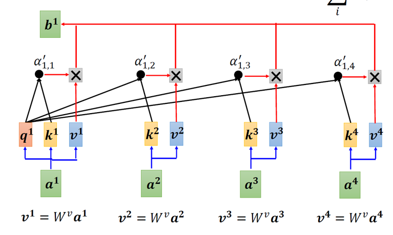
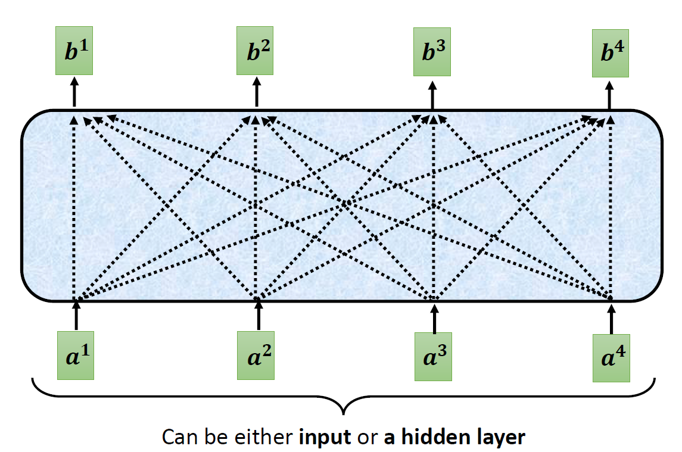

# Vision Transformer

Paper：https://arxiv.org/abs/2010.11929v2

Code：https://github.com/lucidrains/vit-pytorch/blob/main/vit_pytorch/vit.py

___
 
 主要流程：

 1. 将输入图片分成若干个 16*16 的小patches
 2. 将每个patches都输入到Embedding层（Linear Projection of Flattened Patches），输出得到每个patch对应的向量，也被称为Token
 3. 在这一系列Token的前面加一个class token（参考的BERT），这个class token与其他Token的维度相同
 4. 在上面的基础上加上一个位置编码 Position Embedding
 5. 将前面的输出送进Transformer Encoder （Encoder Blocks堆叠L次）
 6. **分类任务**的话，接下来将class token的结果取出来，输入到MLP Head中即可；**分割任务**则删除类标记，直接将Transformer的输出映射回每个patch，并对每个patch进行解码，生成对应的分割掩码，不需要经过MLP Head。

 网络结构图：

 

 ## Embedding层

> 对于标准的Transformer模块，要求输入的事token（向量）序列，即二维矩阵[num_token, token_dim]
功能：实现流程中的1，2步。
- 在代码实现中直接通过一个卷积层来实现，卷积核大小为16×16，stride为16，卷积核个数为768（ViT-B）
- [224, 224, 3] -> [14, 14, 768] -> [196, 768]
- 在输入Transformer Encoder之前需要加上[class] token 以及Position Embedding，都是可训练参数
- 拼接[class] token: Cat([1, 768], [196, 768]) -> [197, 768]
- 叠加Position Embedding：[197, 768] -> [197, 768] 论文中实验证明，位置编码不是很重要，默认使用1D的位置编码

## Transformer Encoder

> Transformer Encoder 将Encoder Block 重复堆叠L次。

接下来详细介绍Encoder Block：

- [ ] Layer Norm
- [ ] Multi-Head Attention
- [ ] Dropout
- [ ] MLP Block

### Layer Norm

> BN是对一个batch数据的每个channel进行Norm处理，但LN是对单个数据的指定维度进行Norm处理与batch无关

为什么不使用直接BN呢，因为在RNN这类时序网络中，时序的长度并不是一个定值（网络深度不一定相同），比如每句话的长短都不一定相同，所有很难去使用BN

### Multi-Head Attention

首先了解下什么是Self-Attention。$Attention(Q,K,V)=softmax(\frac{Q·K^T}{\sqrt{d_k}})V$

计算流程如下：

**q**：query，去匹配（match）每一个key

**k**：key，被q匹配

**v**：value，可以认为是从输入a中学习到的信息

1. 首先将输入送进Embedding层，映射到更高的维度上，x -> a
2. 然后a分别经过三个参数矩阵（$W^q, W^k, W^v$，参数共享），得到q，k，v；在代码中，这三个参数矩阵直接通过三个全连接层实现
3. 接下来将q和k进行match，具体就是dot-product（点积）运算，并除以一个缩放因子$\sqrt{d}$，即$\alpha_{1,i}=\frac{q^1\cdot{k^i}}{\sqrt{d}}$ $\alpha_{2,i}=\frac{q^2\cdot{k^i}}{\sqrt{d}}$，其中，d是对应k的维度（元素个数）。每个q都要与每个k做点积运算
4. 然后将每个$\alpha$经过softmax得到注意力分数$\hat{\alpha}$。使用softmax是因为进行点乘后的数值很大，会导致通过softmax后梯度变得很小。softmax是为了获取这一系列相似度值的占比（也就是权重值$\hat{\alpha}$）
5. 最后一步将$\hat{\alpha}$与v相乘得到b，$b_1=\sum_i{\hat{\alpha}_{1,i}\times v^i}$。相关性越高的，$b_i$就越接近那个数值

**总结下Q、K、V的作用**：
* q和k获取相似度
* softmax是为了获取这一系列相似度值的占比（也就是权重值）
* 加权求和v也就是本身进行加权，求和是为了每个向量和完整序列之间的关系值计算
* qkv这一系列操作的目的就是先通过对本身的各个向量值进行相似度计算，然后通过softmax进行Normalization获取本身向量的权重值，在和本身进行加权计算，最后在求和，这样子就获取了一个向量和本身所有的向量的权重值，然后将所有向量的权重值作为输入向量，这也就是所谓的自注意力机制。

**内部细节图** 

**抽象图** 

**接下来是Multi-Head self-Attention**

Encoder Block流程图截屏自B站@霹雳吧啦Wz，此处也向他的系列教学视频表示感谢~

 

